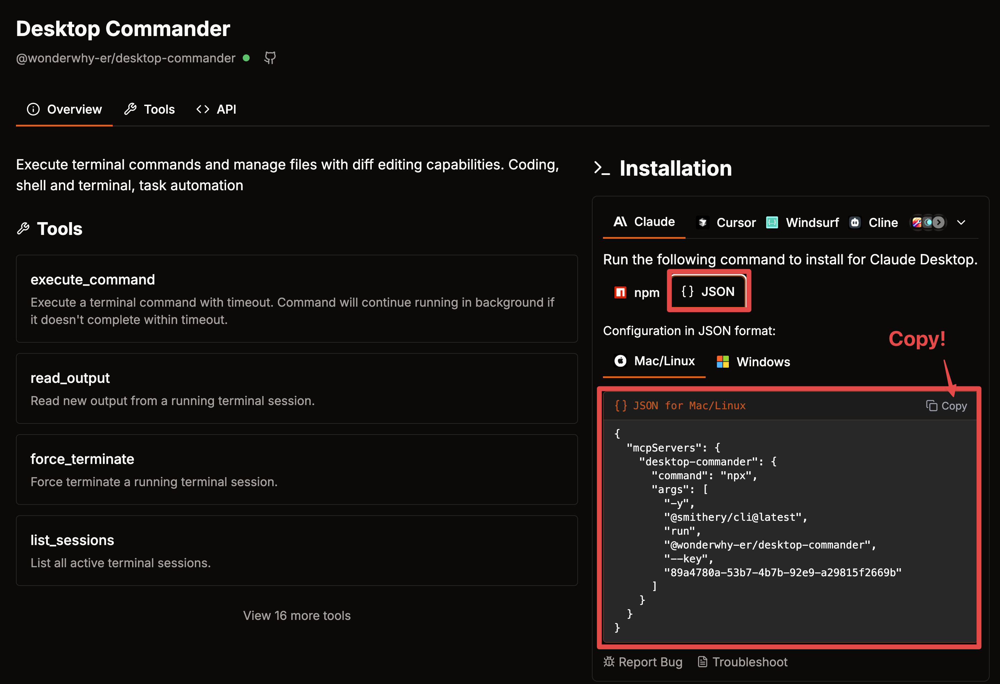

# LangGraph Agent with MCP

[](README.md) [](README_KOR.md)

[](https://github.com/teddylee777/langgraph-mcp-agents)
[](https://opensource.org/licenses/MIT)
[](https://www.python.org/)
[](https://github.com/teddylee777/langgraph-mcp-agents)


## Project Overview


`LangChain-MCP-Adapters` is a toolkit provided by **LangChain AI** that enables AI agents to interact with external tools and data sources through the Model Context Protocol (MCP). This project provides a user-friendly interface for deploying ReAct agents that can access various data sources and APIs through MCP tools.

### Features

- **Streamlit Interface**: User-friendly web interface for interacting with LangGraph `ReAct Agent` with MCP tools
- **Tool Management**: Add, remove, and configure MCP tools directly through the UI(supports Smithery JSON Format). This happens dynamically without restarting the application.
- **Streaming Responses**: See agent responses and tool calls in real-time
- **Conversation History**: Track and manage your conversation with the agent

## MCP Architecture

MCP (Model Context Protocol) consists of three main components.

1. **MCP Host**: Programs that want to access data through MCP, such as Claude Desktop, IDEs, or LangChain/LangGraph.

2. **MCP Client**: Protocol clients that maintain 1:1 connections with servers, acting as intermediaries between hosts and servers.

3. **MCP Server**: Lightweight programs that expose specific functionalities through the standardized model context protocol, serving as key data sources.

## Docker Setup

You can easily run this project using Docker without setting up a local Python environment.

### Prerequisites

- [Docker](https://www.docker.com/get-started) installed on your system
- Install Docker Desktop for Apple Silicon

### Run with Docker Compose

1. Create a `.env` file with your API keys in the project root directory.

(Note) Not all API keys are required. Only enter them as needed.
- `ANTHROPIC_API_KEY`: If you enter an Anthropic API key, you can use the "claude-3-7-sonnet-latest", "claude-3-5-sonnet-latest", "claude-3-haiku-latest" models.
- `OPENAI_API_KEY`: If you enter an OpenAI API key, you can use the "gpt-4o", "gpt-4o-mini" models.

```bash
cp .env.example .env
```

Insert your API keys into the `.env` file.

```bash
ANTHROPIC_API_KEY=your_anthropic_api_key(optional)
OPENAI_API_KEY=your_openai_api_key(optional)
```

2. Choose the appropriate Docker Compose file based on your system architecture.

#### For AMD64/x86_64 Architecture (Intel/AMD processors)

```bash
# Run the container
docker compose up -d -f docker-compose.yaml
```

#### For ARM64 Architecture (Apple Silicon M1/M2/M3)

```bash
# Run the container
docker compose up -d -f docker-compose-mac.yaml
```

3. Access the application at http://localhost:8585 in your browser


#### Custom Configuration

If you need to modify ports or other settings, edit the respective docker-compose.yaml files before building.

## Installation

1. Clone this repository

```bash
git clone https://github.com/yourusername/langgraph-mcp-agents.git
cd langgraph-mcp-agents
```

2. Create a virtual environment and install dependencies using uv

```bash
uv venv
uv pip install -r requirements.txt
source .venv/bin/activate  # On Windows, use: .venv\Scripts\activate
```

3. Create a `.env` file with your API keys(from `.env.example`)

```bash
ANTHROPIC_API_KEY=your_anthropic_api_key
OPENAI_API_KEY=your_openai_api_key(optional)
TAVILY_API_KEY=your_tavily_api_key(optional)
LANGSMITH_TRACING=true
LANGSMITH_ENDPOINT=https://api.smith.langchain.com
LANGSMITH_API_KEY=your_langsmith_api_key
LANGSMITH_PROJECT=your_langsmith_project
```

## Usage

1. Start the Streamlit application.

```bash
streamlit run app.py
```

2. The application will launch in your browser, displaying the main interface.

3. Use the sidebar to add and configure MCP tools

You may visit to [Smithery](https://smithery.ai/) to find useful MCP servers.

First, select the tool you want to use.

Press COPY button JSON Configurations on the right side.



Paste copied JSON string to the `Tool JSON` section.


Press `Add Tool` button to the "Registered Tools List" section.

Finally, "Apply" button to apply changes to initialize the agent with the new tools.


4. Check the status of the agent.


5. Ask questions in the chat interface to interact with the ReAct agent that utilizes the configured MCP tools.


## Hands-on Tutorial

For developers who want to dive deeper into how MCP integration works with LangGraph, we've provided a comprehensive Jupyter notebook tutorial:

- link: [MCP-HandsOn-ENG.ipynb](./MCP-HandsOn-ENG.ipynb)

This hands-on tutorial covers:

1. **MCP Client Setup** - Learn how to configure and initialize MultiServerMCPClient for connecting to MCP servers
2. **Local MCP Server Integration** - Connect to a locally running MCP server via SSE and Stdio methods
3. **RAG Integration** - Use MCP to access a retriever tool for document search functionality
4. **Mixed Transport Methods** - Combine different transport protocols (SSE and Stdio) in a single agent
5. **LangChain Tools + MCP** - Integrate native LangChain tools alongside MCP tools

The tutorial walks through practical examples with step-by-step explanations to help you understand how to build and integrate MCP tools into your LangGraph agents.

## License

MIT License 

## References

- https://github.com/langchain-ai/langchain-mcp-adapters